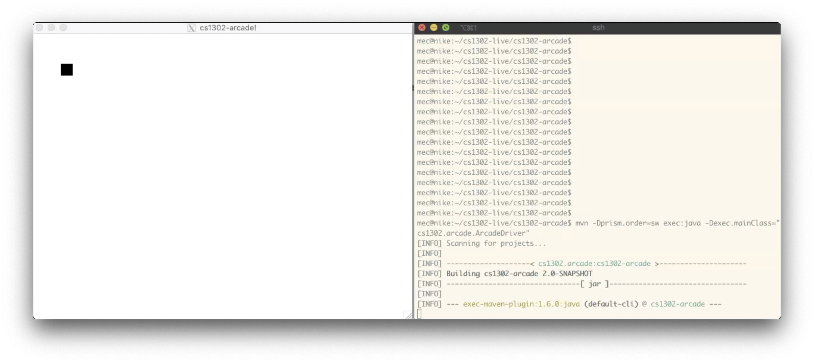

# CSCI 1302 - Arcade App v2019.fa

This document contains the description for the `cs1302-arcade` project
assigned to the students in the Fall 2019 CSCI 1302 classes
at the University of Georgia.

**Please read the entirety of this file before
beginning your project.**

## Due Dates

* [Team Application](https://ugeorgia.ca1.qualtrics.com/jfe/form/SV_etSoMZ0TxIzvcln) due by **TUE 2019-11-12 @ 11:55 PM**.
* Partial Submission 1 (including [reflections](#reflections)) due by **TUE 2019-11-19 @ 11:55 PM**.
* Partial Submission 2 (including [reflections](#reflections)) due by **TUE 2019-11-26 @ 11:55 PM**.
* Partial Submission 3 (including [reflections](#reflections)) due by **WED 2019-12-04 @ 11:55 PM**.
* Final Submission (including [reflections](#reflections)) due by **WED 2019-12-11 @ 3:30 PM**.

## Important Final Project Policies

* Please note the Final Submission date/time.
  For this project, **no late submissions will be accepted after 11:55PM on WED 2019-12-11**.
  Late submissions will be accepted between **03:30:01 PM -- 11:55:00 PM on WED 2019-12-11**,
  which will incur the standard penalty for one day late.

* Submissions from teams who do not submit a completed team application on time will
  not be accepted for grading. Exceptions will only be made under extenuating circumstances,
  such as family or medical emergencies, and must be approved by the instructor.

* Teams are required to add the following users as collaborators to the private
  GitHub-hosted Git repository that they setup for their project:

  * [`mepcotterell`](https://github.com/mepcotterell) -- Dr. Cotterell
  * [`bjb211`](https://github.com/bjb211) -- Dr. Barnes

  Your instructors will have access to your private repository's history. This
  means that they can see who did what and when based on the log.

## Table of Contents

* [Academic Honesty](#academic-honesty)
* [Updates](#updates)
* [Project Description](#project-description)
* [Project Requirements & Grading](#project-requirements--grading)
  * [Functional Requirements](#functional-requirements)
  * [Non-Functional Requirements](#non-functional-requirements)
  * [Absolute Requirements](#absolute-requirements)
* [How to Download the Project](#how-to-download-the-project)
* [Submission Instructions](#submission-instructions)
* [Appendix - Useful Links](#appendix---useful-links)
* [Appendix - Starter Code](#appendix---starter-code)
* [Appendix - Workflow](#appendix---workflow)
* [Appendix - FAQ](#appendix---faq)

## Academic Honesty

You agree to the Academic Honesty policy as outlined in the course syllabus,
course website, and your team application. Furthermore, you must adhere to
the copyright notice and licensing information at the bottom of this document.

Additionally, we recognize that free and open-source software implementations
of the games described in this project are available. You are expected to write
your games from scratch. The only exception to this is the use of existing
art / visual assets, provided that you include proper attribution to the
author(s) of any creative works you incorporate into your submission.

## Updates

Updates will be posted here.
If there has been an update and you have already cloned the project to Nike,
then you can update your copy of the project using the `$ git pull skeleton master`
command while inside of your project directory.

## Project Description

Your pair programming team's goal is to implement, from scratch, a single GUI application
in Java 8 using JavaFX 8 that provides an arcade with your own Java + JavaFX implementations
of at least two playable games.

Your team must choose one game from each of the following groups:

* **Group 1**

  * [Asteroids](https://en.wikipedia.org/wiki/Asteroids_(video_game))

  * [Centipede](https://en.wikipedia.org/wiki/Centipede_(video_game))

  * [Tetris](https://en.wikipedia.org/wiki/Tetris)

* **Group 2**

  * [Mancala](https://en.wikipedia.org/wiki/Mancala)

  * [Reversi](https://en.wikipedia.org/wiki/Reversi)

  * [Chess](https://en.wikipedia.org/wiki/Chess)

You have a lot of flexibility with regard to the visuals of your games.
As long as the functional requirements are met and the game mechanics are easily
recognizable, you are free to make each game look and feel however you want
(please keep it appropriate). The general functional requirements for each game
group are provided later in this document.

Part of software development is being given a goal but not necessarily being
given instruction on all of the details needed to accomplish that goal. For example,
even though working with things like keyboard and mouse-related events
haven't been explicitly covered in class, you are going to need to look up how to do
these things in order to complete this project. **Some [starter code]((#appendix---starter-code))
and a generously helpful [FAQ](#appendix---faq) are provided.**

This project is also designed to help you better understand the usefulness of good
class design. While you can technically write your entire JavaFX-based
GUI application entirely in the `start` method, this will make your code messy,
hard to read, possibly redundant, and likely more prone to errors.
Before you write any code, you should plan out your application's scene graph
(i.e., the containment hierarchy), and design custom components as needed.
If you find that you are writing a lot of code related to a specific component
(e.g., setting styling, adding event handlers, etc.), then it's probably
a good idea to make a custom version of that component in order to reduce
clutter. **You are strongly encouraged to consider swapping out multiple scenes
for this project.**

### Learning Outcomes

* Plan, design, implement, test, debug, and deploy a complete object-oriented
  software solution in Linux/Unix environment (1302-LO1)
* Utilize inheritance and polymorphism in a software project (1302-LO3-LO4).
* Develop a GUI for a software project (1302-LO7).
* Implement exception-handling in a software project (1302-LO8).
* Understand and apply language basics using an OOP language (1302-LO11).

### Functional Requirements

* **Main Application Requirements (10 points):** The main part of your
  application needs to fulfill the following functional requirements:

  * *Game List (5 points):* Your application should present
    the user with a visual / graphical list of available games. Starting a game should
    either swap the scene in the current stage or create a new application modal stage
    on which to display the game's scene graph.

  * *Multiple Games per Execution (5 points):* Your application should allow
    users to exit one game (without exiting the entire application) and start
    the same game again (with its state reset) or start the other game.

* **Group 1 Game Requirements (45 points):** Your Group 1 game implementation
  needs to fulfill the following functional requirements:

  * *UI, Mechanics, and Scoring (40 points):* The user interface and game mechanics
    must be easily recognizable and consistent with traditional implementations of
    the game you chose (see the Wikipedia links for more information). Your game
    must provide a consistent scoring mechanism and display the score(s) to
    the user somewhere in the user interface. Additionally, games in this group
    must provide a leveling mechanism by which the game's level of difficulty
    increases over time as the "level" increases. A minimum of three levels is
    required, however, there is no maximum level requirement. The first level
    should be easy enough for most players familiar with the game to complete.

  * *Controls (5 points):* You are required to provide keyboard controls
    for a game in this group. If anything is not intuitive, then you need to let
    the user know before the game starts.

* **Group 2 Game Requirements (45 points):** Your Group 2 game implementation
  needs to fulfill the following functional requirements:

  * *UI, Mechanics, and Scoring (40 points):* The user interface and game mechanics
    must be easily recognizable and consistent with traditional implementations of
    the game you chose (see the Wikipedia link for more information). Your game
    must provide a consistent scoring mechanism and display the score or scores to
    the users somewhere in the user interface.

  * *Controls (5 points):* You are required to provide intuitive mouse or
    keyboard controls for a game in this group. If anything is not intuitive,
    then you need to let the user know before the game starts.

  * *Note:* You are only required to provide a
    human player vs. human player mode for for a multiplayer game in this category.
    Feel free to add support for computer players, however, such support will not
    contribute to your grade.

* **Extra Credit 1 (5 points):** Add some kind of animated intro to your application.
  One potential way to accomplish this is by using a separate scene for your intro.
  This intro should include, in addition to some kind of animated element, the
  application title (i.e., `cs1302-arcade`), your team name, and the name of each
  team member. An animated GIF, by itself, does not meet this requirement. We
  want one or more nodes in the scene to move around. **If you want the grader to
  check for this requirement, then you must make sure it is included in your
  last update to `REFLECTION.md`.**

* **Extra Credit 2 (5 points):** Add a [high score table](https://en.wikipedia.org/wiki/Score_(game)#High_score)
  to your application, accessible via your application's menu (menu bar or otherwise).
  The table needs to actually keep track of the high scores for each game and include
  player initials. This may involve modifications in other areas of your application to
  accommodate this. In order to receive full credit for this extra credit functional
  requirement, the high score table must persist over time and over separate executions
  of your application. This will involve reading and writing to a file.
  **If you want the grader to check for this requirement, then you must
  make sure it is included in your last update to `REFLECTION.md`.**

### Non-Functional Requirements

A non-functional requirement is *subtracted* from your point total if
not satisfied. In order to emphasize the importance of these requirements,
non-compliance results in the full point amount being subtracted from your
point total. That is, they are all or nothing.

* **User-Friendly Experience (10 points):** The windows of your application
  should not exceed a pixel dimension of `1280` (width) by `720` (height). 
  Additionally, except for reasonable delays resulting from X forwarding, your 
  application should not hang/freeze or crash during execution. If a grader 
  encounters lag, then they will try to run your application locally using Oracle
  Java 8.

* **Local Assets / Resources (10 points):** All assets (e.g., images) need to
  be pre-downloaded and placed under `resources`. You are not allowed
  to load assets directly from the web. This will help make your app faster.

  You should place local files under `resources` in your project directory (you may need to
  create the `resources` directory). URLs prefixed with `file:` should be relative to your
  project directory. 
   
  Example:
   
  | Resource                | URL                            |
  |-------------------------|--------------------------------|
  | `resources/icon.png`    | `"file:resources/icon.png"`    |
  | `resources/foo/img.png` | `"file:resources/foo/img.png"` |
  
* **(20 points) Code Style Guidelines:** You should be consistent with the style 
  aspect of your code in order to promote readability. Every `.java` file that
  you include as part of your submission for this project must be in valid style 
  as defined in the [CS1302 Code Style Guide](https://github.com/cs1302uga/cs1302-styleguide).
  All of the individual code style guidelines listed in that document are part 
  of this single non-functional requirement. Like the other non-functional
  requirements, this requirement is all or nothing. 
  
  **NOTE:** The [CS1302 Code Style Guide](https://github.com/cs1302uga/cs1302-styleguide)
  includes instructions on how to use the `checkstyle` program to check
  your code for compliance on Nike.

* **In-line Documentation (10 points):** Code blocks should be adequately documented
  using in-line comments. This is especially necessary when a block of code
  is not immediately understood by a reader (e.g., yourself or the grader).

* **Attribution (10 points):** Proper attribution should be given for all assets (e.g.,
  art, sound, music, etc.) that are not authored by members of your project team.
  You should make an `ATTRIBUTION.md` file that contains this information. For each
  asset, please provide the following information:

  * Asset Name
  * Path within your project
  * Author citation
  * URL
  * License

  Here is an example of an entry in an `ATTRIBUTION.md` file:

  ```
  ## Alien
  * `resources/alien.png`
  * Carlos Alface. "Alien" November 15, 2014
  * https://opengameart.org/content/alien-1
  * Creative Commons Attribution 3.0 Unported (CC BY 3.0)
  ```

<a name="reflections"/>

* **(40 points; 10 points each) Reflection Updates:** Before each submission
  deadline mentioned towards the beginning of this document, you
  will need to update your project's `REFLECTION.md` file to include a new
  section describing:

  1. That work that has been done since the last update (you may summarize your Git log);
  2. The work you plan to complete before the next deadline (except for the last submission); and
  3. What problems, if any, you have encountered related to this project.

  These changes, including your work in progress, must be committed to your
  repository. The commit should also be tagged using Git. For example:

  ```
  $ git tag -am "Partial Submission 1" deadline1
  $ git push origin --tags
  ```

  For each reflection update, you will be graded on the existence of the related
  Git tag and the germaneness of the content included in your `REFLECTION.md`
  file.

### Absolute Requirements

An absolute requirement is similar to a non-functional requirement, except that violating
it will result in an immediate zero for the assignment. In many cases, a violation
will prevent the graders from evaluating your functional requirements. No attempts will be
made to modify your submission to evaluate other requirements.

* **Project Structure:** The location of the default
  package for the source code should be a direct subdirectory called `src/main/java`.
  When the project is compiled using Maven, the the default package for compiled
  code should be `target/classes`.

  If you follow this structure, then you might type the following to clean, compile,
  and run your code using Maven, assuming you are in the top-level project directory:

  ```
  $ mvn clean
  ```

  ```
  $ mvn -e compile
  ```

  ```
  $ export MAVEN_OPTS=-Dprism.order=sw;
  $ mvn -e exec:java -Dexec.mainClass="cs1302.arcade.ArcadeDriver"
  ```
  
  The following may also work to run the program:
  ```
  $ mvn -e -Dprism.order=sw exec:java -Dexec.mainClass="cs1302.arcade.ArcadeDriver"
  ```

  Your main application class should be `cs1302.arcade.ArcadeApp`.
  The driver class should be `cs1302.arcade.ArcadeDriver`.
  Any additional `.java` files in your project are expected to fulfill all
  non-functional and absolute requirements, even if the main parts of the
  project do not use them. You may assume graders will compile your source
  code in an order that satisfies compilation dependencies.
  You should remove any `.java` files that you do not need before submission.

* **Team Membership:** Formalized team membership via a team application
  submission made before the team application deadline is required. Furthermore,
  you must adhere to the policies outlined in the syllabus and the team application.
  Deviations will likely result in zero on the assignment for both team members.
  Except for extenuating circumstances, such as family or medical emergencies, that are
  approved by the instructor, team issues such as scheduling and coordination are the
  responsibility of each team member. If you identify a team issue early on (first week),
  then we encourage you to contact your instructor by sending a private post to
  "Instructors" via the course Piazza as soon as possible.

* **GitHub Collaborators:** Teams are required to add the following users as collaborators
  to the private GitHub-hosted Git repository that they setup for their project:

  * [`mepcotterell`](https://github.com/mepcotterell) -- Dr. Cotterell
  * [`bjb211`](https://github.com/bjb211) -- Dr. Barnes

  Your instructors will have access to your private repository's history. This
  means that they can see who did what and when based on the log.

* **Development Environment:** This project must be implemented 
  in Java 8, and it *must compile and run* correctly on Nike using the specific
  version of Java 8 that is setup according to the instructions provided
  by your instructor. For this requirement, the term *compile* should be 
  interpreted as *compile with no errors or warnings*.
  
  If you decide to introduce additional `.java` files into your project,
  then they are expected to fulfill all non-functional and absolute requirements, 
  even if the main parts of the project do not use them. You may assume
  graders will compile your source code in an order that satisfies
  compilation dependencies. You should remove any `.java` files that you
  do not need before submission.

* **No FXML or use of Scene Builder:** FXML and SceneBuilder
  are advanced tools that are not currently covered in this course. Use of
  either for this project is prohibited. Please note that the project is
  not easier with these tools. In most cases, they actually make the
  project harder, especially since those topics have not been covered.

### Grading

The graders will compile and run your code on Nike using Maven (likely via
the provided `Makefile`). They will test each of the requirements and total up the points
earned. This project is worth 100 points. Students have an opportunity to earn
an additional 10 points via extra credit.

## How to Download the Project

These instructions assume that both team members have
[setup their SSH keys](https://git.io/fjLzB#setting-up-ssh-keys)
on Nike and GitHub.

1. If you have not done so already, you or your partner should create a
   free GitHub-hosted private Git repository for your project under one of your GitHub
   accounts called `cs1302-arcade` and add `mepcotterell`, `bjb211`, and the second team
   member as collaborators to that private repository. **In the remaining instructions,**
   **`TEAM_REPO_SSH` will refer to the SSH URL for that repository as provided by GitHub.**

1. One team member should clone their empty team repository to their Nike account and
   setup a link to the remote skeleton repository provided by your instructor. A sequence
   of commands is provided below. You should make every effort to understand what
   each command is doing *before* you execute the command.

   ```
   $ git clone TEAM_REPO_SSH cs1302-arcade
   $ cd cs1302-arcade
   $ git remote add skeleton https://github.com/cs1302uga/cs1302-arcade.git
   $ git pull skeleton master
   $ git push origin master
   ```

   This team member should now be good to go. A pair programming workflow is provided
   in the [Appendix - Workflow](#appendix---workflow) section, which provides an
   overview of one way to send / receive changes from team member to team member
   while minimizing basic merge conflicts.

1. The other team member should now be able to perform the same sequence of steps,
   omitting the last two steps:

   ```
   $ git clone TEAM_REPO_SSH cs1302-arcade
   $ cd cs1302-arcade
   $ git remote add skeleton https://github.com/cs1302uga/cs1302-arcade.git
   ```

   This team member should now be good to go. A pair programming workflow is provided
   in the [Appendix - Workflow](#appendix---workflow) section, which provides an
   overview of one way to send / receive changes from team member to team member
   while minimizing basic merge conflicts.

If you followed these instructions correctly, then the steps above should have
created a directory called `cs1302-arcade` in your present working directory that
contains the project files as well as a local copy of the repository.
If you have any problems with any of these procedures, then please
ask about them on Piazza.

## Submission Instructions

You will be submitting your project via Nike before the final deadline.
**Both team members are required to submit according to these instructions.**

1. **CRITICAL:** Make sure that all tracked files are staged and committed with
   a good log message and that the `master` branch is checked out. Take special
   care to ensure that your fully-committed `master` branch reflects the project
   you wish to submit. Compare your log to the log on GitHub. If you do not have
   the most recent version of your team's project, then you may need to do a
   `git pull`. Finally, Using `git status` should not indicate any untracked files.

1. Change into the parent directory of your local copy of the repository and
   submit it using the `submit` command:

   ```
   $ submit cs1302-arcade cs1302a
   ```

If you have any problems submitting your project, then please contact the CSCI
1302 Support Team by sending a private post to "Instructors" via the course
Piazza as soon as possible.

# Appendix - Useful Links

## JavaFX 8

* [Package: `javafx`](https://docs.oracle.com/javase/8/javafx/api/toc.htm)
* [JavaFX CSS Reference Guide](https://docs.oracle.com/javase/8/javafx/api/javafx/scene/doc-files/cssref.html)
* [Styling UI Controls with CSS](https://docs.oracle.com/javase/8/javafx/user-interface-tutorial/apply-css.htm)

## Resources

* [Reference Manual](https://git-scm.com/docs) - alternative to the manual pages for `git`
* [Pro Git (Book)](https://git-scm.com/book/en/v2) - contains a lot of good examples
* [Version Control by Example (Book)](https://ericsink.com/vcbe/index.html) - excellent introduction to version control by Eric Sink

# Appendix - Starter Code

While you may be comfortable creating a standard desktop application using JavaFX, you
may be less familiar with how to put together a game. To illustrate some of the graphical
capabilities of JavaFX, including event handlers for mouse and keyboard input, some
starter code has been provided. **Please read, compile, and execute the starter code.**
You are not required to use the starter code as a foundation for your program; however,
you are required to meet the Project Structure absolute requirement. 

Here is a video that demonstrates the executation of the starter code 
(click [here](https://www.youtube.com/watch?v=mwdF5eZoCHc) or the image below):

[](https://www.youtube.com/watch?v=mwdF5eZoCHc)

Here are some links to the API documentation for some of the keyboard-related and
mouse-related classes used in the starter code:

* [`javafx.scene.input.KeyEvent`](https://docs.oracle.com/javase/8/javafx/api/javafx/scene/input/KeyEvent.html):
  used as the input parameter type for the `handle` method in a keyboard-related event handler.
  
* [`javafx.scene.input.KeyCode`](https://docs.oracle.com/javase/8/javafx/api/javafx/scene/input/KeyCode.html):
  an enumeration that describes the possible outputs of calling `getCode()` on a `KeyEvent` object.
  
* [`javafx.scene.input.MouseEvent`](https://docs.oracle.com/javase/8/javafx/api/javafx/scene/input/MouseEvent.html):
  used as the input parameter type for the `handle` method in a mouse-related event handler.
  
Please note that the datatype for a keyboard-related event handler needs to be `EventHandler<? super KeyEvent>` and
not merely `EventHandler<KeyEvent>`. Likewise, the the datatype for a mouse-related event handler needs to be 
`EventHandler<? super MouseEvent>` and not `EventHandler<MouseEvent>`.

# Appendix - Workflow

**NOTE:** We recommend that you read
[Pro Git Ch. 3.4](https://git-scm.com/book/en/v2/Git-Branching-Branching-Workflows)
before reading our suggested pair programming workflow below.

For this group-based project, you and your partner are required to do
**pair programming**. According to [Williams & Kessler](https://t.uga.edu/4S0):

> Pair programming is a practice in which two programmers work side-by-side
> at one computer, continuously collaborating on the same design, algorithm,
> code, or test. [...] one person drives (has control of the keyboard or is
> recording design ideas) while the other is continuously reviewing the work.

If you've followed the instructions included
[earlier in this project description](#how-to-download-the-project),
then you and your partner already have a GitHub-hosted private Git repository
as well as local working copies of that repository on your respective Nike
accounts. The challenge now is how to effectively collaborate using these
three distributed copies of the repository. That is where the workflow
below comes into play. In this context, a workflow describes a sequence of
steps that you and your partner can take to effectively collaborate on the
project and avoid simple merge conflicts.

**The steps we provide in this workflow are suggested, however, they are not required.**
If you and your partner decide on a better workflow, then feel free to
use that instead. If it works really well, then I encourage you to describe it
in a Piazza post to the rest of the class.

1. Decide whose turn it is to **drive**. That person should login to
   their Nike account and change into the local working copy of their
   project's repository. The rest of these steps assume this person
   is executing the commands. When it comes time to change who is
   driving, that person should follow these steps from the beginning.

1. Use `git status` to see the state of the current branch.

   1. Regardless of what branch you are on, stage and commit all tracked files.
      If you manually added any new files, then you should add them and
      commit them.

      ```
      $ git status
      ```

   1. If the branch that you are currently on is not `master`, then
      checkout `master` and repeat the previous sub-step to make
      sure everything is committed in `master`.

      ```
      $ git checkout master
      ```

      If you want / need to, merge the changes from the other branch
      into `master`, then delete the other branch.

      ```
      $ git merge branch_name
      $ git branch -d branch_name
      ```

      **MERGE CONFLICT?** If you merge, then you may encounter a merge conflict.
      In this scenario, Git's output will tell you what files are affected. You
      must then edit those files using your text editor of choice to
      manually resolve the conflict. Git will mark lines in the affected files
      with a special `diff` syntax so that you can easily identify them, then make
      edits to either pick one version or combine them in a desired way.
      The source code should be clean and free of special `diff` syntax
      before you save. Once an affected file is saved, you should
      stage and commit it. The merge conflict is not technically resolved
      until all affected files are fixed, staged, and committed -- these
      can be individual commits or one single commit with all affected files
      on the stage.

1. Now that your local working copy is cleaned up, you should pull
   changes from your team repository into your local working copy.

   ```
   $ git pull origin master
   ```

   If you encounter a merge conflict, then see the **"MERGE CONFLICT?"**
   note provided earlier in this workflow.

1. Instead of working on your project directly in the `master` branch,
   create a branch for this programming session based on the most
   recent commit:

   ```
   $ git branch driver
   $ git checkout driver
   ```

   Alternatively, you can use:

   ```
   $ git checkout -b driver
   ```

1. Work on the project. As often as is reasonable, you should stage and
   commit tracked files in this branch. If you add new source code files
   or visual assets (e.g., images in `src/main/resources`), then be
   sure to add and commit them. Liberal use of `git status` is highly
   recommended.

1. Once you are done with this programming session, perhaps for the day
   or because you want to switch who is driving, you should do the
   following:

   1. Stage and commit tracked files. Also ensure that new files that
      you added recently are staged and committed. Remember, you can use
      `git status` to see what's going on.

   1. Checkout the `master` branch, merge `driver` into `master`, resolve
      conflicts if necessary, then delete the `driver` branch.

      ```
      $ git checkout master
      $ git merge driver
      $ git branch -f driver
      ```

      If you encounter a merge conflict, then see the **"MERGE CONFLICT?"**
      note provided earlier in this workflow.


   1. Finally, push your changes up to your team's GitHub repository.

      ```
      $ git push origin master
      ```
      If your partner worked on the project while you were also working
      on the project, then it's possible that you don't have the most
      recent changes. In this scenario, return to the first step and
      quickly repeat -- much of the work is usually minimal in this
      scenario, assuming you both espouse the same workflow.

# Appendix - FAQ

Below are some frequently asked questions related to this project.
You may also find the [`cs1302-gallery` FAQ](https://github.com/cs1302uga/cs1302-gallery#appendix---faq)
a useful resource as well.

1. **How do I make my game run at *x* frames per second (e.g., 60 FPS)?**

   If you are using a single `Timeline` object for your main game loop, then duration of all
   key frames in the main game loop should sum to exactly `1000 / x` ms (e.g.,
   `Duration.ofMillis(1000 / 60)`).
   The easiest way to ensure this is to have only one key frame with that duration.

1. **What is a good GUI container for games?**

   You already know that you can setup your scene graph however you want by using and nesting
   different types of layout panes. If you need explicit control over the `x` and `y` positions
   of some nodes, then I recommend using the
   [`Group`](https://docs.oracle.com/javase/8/javafx/api/javafx/scene/Group.html) class.
   Since `Group` is a sub-class of `Node`, you should be able to add a `Group` object anywhere in
   your scene graph just like any other node.

1. **How do I setup event handlers related to mouse and keyboard events?**

   Look at the Javadoc documentation for the
   [`Node`](https://docs.oracle.com/javase/8/javafx/api/javafx/scene/Node.html) class,
   specifically the methods that start with `setOnMouse` and `setOnKey`, to see the
   different types of mouse and keyboard events you can handle. Here is a simple example
   that prints the current time (using
   [`LocalTime`](https://docs.oracle.com/javase/8/docs/api/java/time/LocalTime.html)) to
   standard output when a user clicks on an `ImageView` object (referenced by `iv`) that
   is assumed to be visible within the current scene graph:
   ```java
   iv.setOnMouseClicked(event -> System.out.println(LocalTime.now()));
   ```
   Remember, you can setup these event handlers for any node in the scene graph, including
   the containers.

1. **How can I detect if two nodes in my scene collide?**

   Look at the "Bounding Rectangles" section in the Javadoc documentation for the
   [`Node`](https://docs.oracle.com/javase/8/javafx/api/javafx/scene/Node.html) class.
   The getter methods described in that section return references to
   [`Bounds`](https://docs.oracle.com/javase/8/javafx/api/javafx/geometry/Bounds.html)
   objects, which likely contain useful information regarding the whereabouts of
   node. I would recommend taking a very close look at the methods in that class.

1. **How do I add sound?**

   While JavaFX does support audio playback of various formats, this feature is not
   currently available over X11 forwarding from Nike. **If you incorporate audio into**
   **your application, then take measures to properly deal with the unchecked exceptions**
   **that might get thrown if audio playback is not available.**

1. **How do I make basic shapes appear?**

   Look at the classes in the
   [`javafx.scene.shape`](https://docs.oracle.com/javase/8/javafx/api/javafx/scene/shape/package-summary.html)
   package.

1. **Git won't let me `git pull` my team's repository!?**

   When you tried to `git push`, you likely received some output similar to following

   ```
   To git@github.com:username/cs1302-arcade.git
   ! [rejected]        master -> master (non-fast-forward)
   error: failed to push some refs to 'git@github.com:username/cs1302-arcade.git'
   To prevent you from losing history, non-fast-forward updates were rejected
   Merge the remote changes before pushing again.  See the 'Note about
   fast-forwards' section of 'git push --help' for details.
   ```

   Obviously, you already read the "Note about fast-forwards", as suggested by the
   program output, by referring to:

   ```
   $ git push --help
   ```

   To summarize, this error is likely happening because your team partner has
   recently pushed some commits to your team repository on GitHub. The solution
   is contained right there in the "Note about fast-forwards":

   > If you do not want to lose your work [..] nor the work by the other person [..],
   > you would need to first fetch the history from the repository, create a history
   > that contains changes done by both parties, and push the result back.

   The easiest way to do that is to pull changes from the team repository, resolve
   merge conflicts if necessary, then push.

Have a question? Please post it on the course Piazza.

<hr/>

[](http://creativecommons.org/licenses/by-nc-nd/4.0/)

<small>
Copyright &copy; Michael E. Cotterell and the University of Georgia.
This work is licensed under a <a rel="license" href="http://creativecommons.org/licenses/by-nc-nd/4.0/">Creative Commons Attribution-NonCommercial-NoDerivatives 4.0 International License</a> to students and the public.
The content and opinions expressed on this Web page do not necessarily reflect the views of nor are they endorsed by the University of Georgia or the University System of Georgia.
</small>
